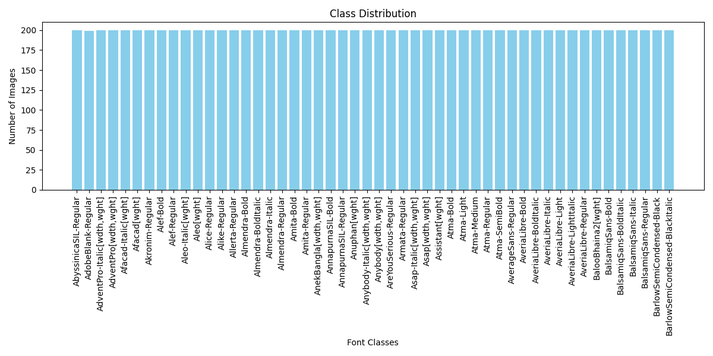
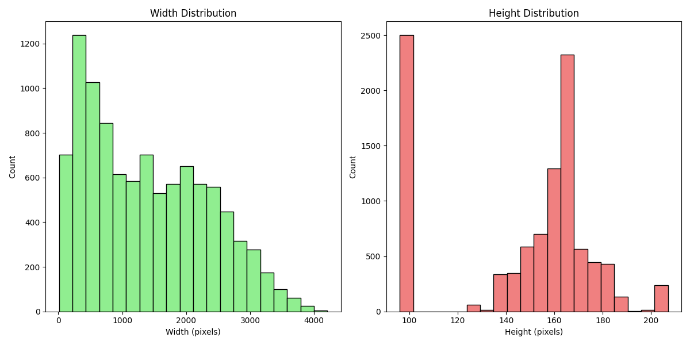
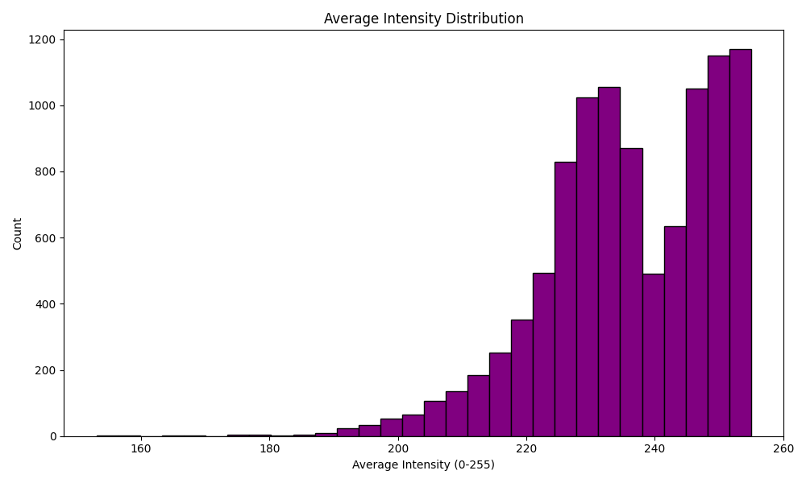

# Multi Class Font Classification using Deep Learning

This project involves building a deep learning model to classify images of words written in different fonts. The model is trained on a dataset of images, with each image belonging to one of 50 different font classes. The project includes data processing, model building, training, evaluation, and deployment using Flask for real-time predictions.

## Setting up the Environment

### Create a Virtual Environment

To create a new environment and install secessary packages run the following comand

```bash
conda env export > environment.yml
conda activate image_cls
```


The following steps were followed to complete the assignment:

1. **Data Preprocessing**
2. **Model Building**
3. **Model Training**
4. **Model Logging**
5. **Model Evaluation**
6. **API for Real-Time Prediction using Flask**
7. **Single Inference (Command Line)**

### 1. Data Preprocessing

To see the distribution and generate figures of Class Distribution, Image Dimentionality (Heigth & Weight) Distribution and Pixel Intensity Distribution, **unzip the datasetset**, your dataset path in 'data_processing.py' and run the following command

```bash
python data_processing.py
```

You can also see these figures in *"fig/"*





The dataset contains 50 folders, each representing a font, and each folder contains images of words written in that specific font. The data preprocessing step includes:

- **Resizing Images**: All images were resized to 224x224 pixels, the required input size for the model.
- **Normalization**: The pixel values of images were normalized to the range [0, 1] by dividing by 255.0.
- **Data Augmentation**: The training dataset was augmented using random transformations such as rotations, shifts, flips, and zooms to increase model generalization.
- **Data Splitting**: The dataset was split into training and validation sets.

The dataset was processed using the `ImageDataGenerator` class in TensorFlow/Keras to handle image loading and augmentation during training.

### 2. Model Building

A **pre-trained convolutional neural network (CNN)** model, specifically **VGG16**, was used as the base model for transfer learning. The model was fine-tuned to classify images into one of the 50 font classes.

#### Key Steps:
- **Loading Pre-trained Model**: A pre-trained ResNet50 model (without the top classification layer) was loaded.
- **Adding Custom Layers**: A custom classification head was added to the model, consisting of:
  - Flatten layer
  - Dense layers with ReLU activation
  - Output layer with softmax activation for multi-class classification.
- **Compilation**: The model was compiled using the Adam optimizer and categorical cross-entropy loss function.

### 3. Model Training

The training script performs the following tasks:
- Loads the processed training and validation datasets.
- Initializes the model and compiles it.
- Uses **early stopping** to prevent overfitting by monitoring validation loss.
- Implements **model checkpoints** to save the best model during training.
- Logs training metrics (accuracy, loss, etc.) to **TensorBoard** for monitoring progress.
- Saves the final model to a `.keras` file for later use.

#### Key Features:
- **Early Stopping**: Stops training if there is no improvement in validation loss for 5 consecutive epochs.
- **Checkpoints**: Saves the model at epochs where the validation loss improves.
- **TensorBoard**: Logs training metrics to visualize the model's progress during training.

To start training, set your paths and hyper-parameters in "data_loader.py", "model.py" and 'train.py'. Then tun this command

```bash
python train.py
```

### 4. Model Logging

During and after training you can see/monitor thr training logs by running the below command.

```bash
tensorboard --log-dir logs
```

And get to the server provided in the command. You can also see my training logs by running this command


### 5. Model Evaluation

After training the model, the evaluation script computes various performance metrics on the test or validation set:

- **Accuracy & Loss**: Overall classification accuracy and loss of the model.
- **Precision, Recall, and F1-Score**: Detailed metrics for each class, using the `classification_report` from sklearn.
- **Confusion Matrix**: Provides a visual representation of classification errors between classes.


#### Key Steps:
- Load the trained model.
- Load the test/validation dataset.
- Make predictions on the test dataset.
- Calculate precision, recall, F1-score, and accuracy using sklearn’s metrics.

To evaluate set your paths in "evaluation.py" the command run this command.

```bash
python evaluatiuon.py
```

### 6. API for Real-Time Prediction using Flask

A Flask API was created to serve the trained model for real-time image classification:

- **API Endpoint**: The `/predict` endpoint accepts image files via POST requests and returns the predicted class label (font) and the corresponding class index.
- **Image Preprocessing**: The uploaded image is resized to 224x224 pixels, normalized, and passed through the model for prediction.
- **Deployment**: The Flask app runs locally, and users can upload images to the `/predict` endpoint for classification.

To run this on an API at first you need to set your paths in 'app/api/py' and then activate the server.

```bash
python app\api.py
```

After the server is running you can run the below command to do inference on an Image

```bash
curl -X POST -F "file=@path_to_image/image.jpg" http://127.0.0.1:5000/predict
```

### 7. Single Inference (Command Line)

You can also do inference with single image by setting paths in 'inference.py' and running this command

```bash
python inference.py
```

### Further Improvement
* The pretrained model used here (VGG16) is good at understanding natural images but not images of texts. So an model better trained on text data or even an OCR CNN model like (CRNN / Tesseract) can be used to get better performance.
* By increasing the data sample of each category and using some more image processing algoridthm performance can be further improved
* A different architecture more suitable for font cliassification (like the one below that is used in this [Paper](https://arxiv.org/pdf/1507.03196) can also be used)


